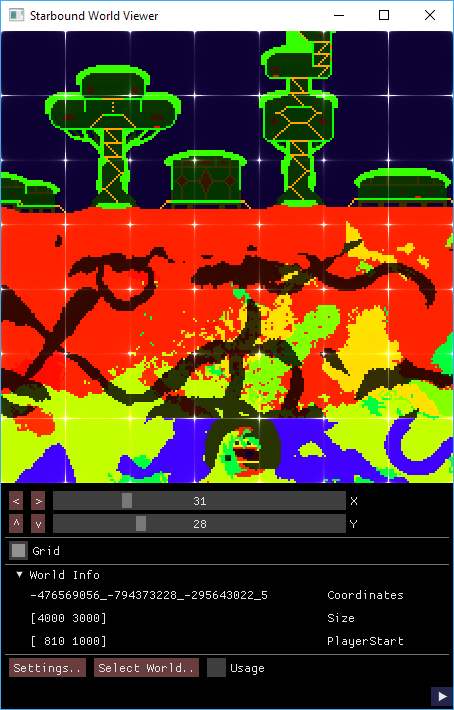

Starbound Map Viewer
====================
[](https://ci.appveyor.com/project/txxia/starbound-map/branch/master)

This tool is built on top of @blixt's awesome work: [Starbound Utilities](https://github.com/blixt/py-starbound).



Feel free to contribute either via submitting pull requests or writing
up issues with suggestions and/or bugs.

Download
--------
https://github.com/txxia/starbound-map/releases

Releasing
---------
```
pyinstaller mapviewer.spec
```

License
-------

[MIT License](./LICENSE)
